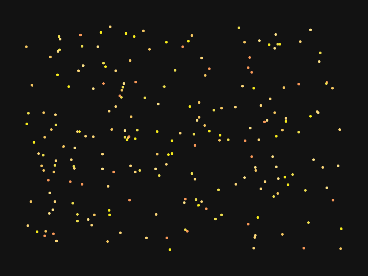
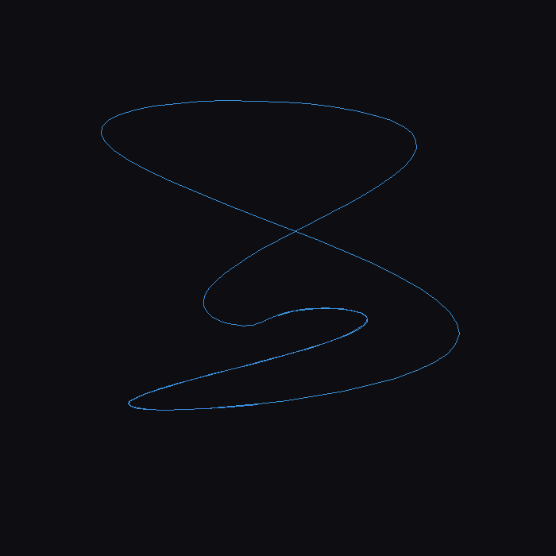
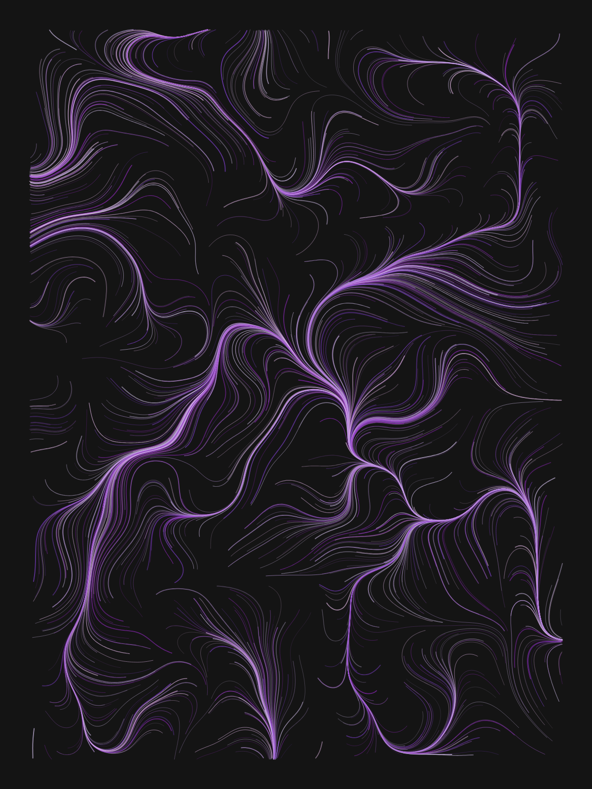
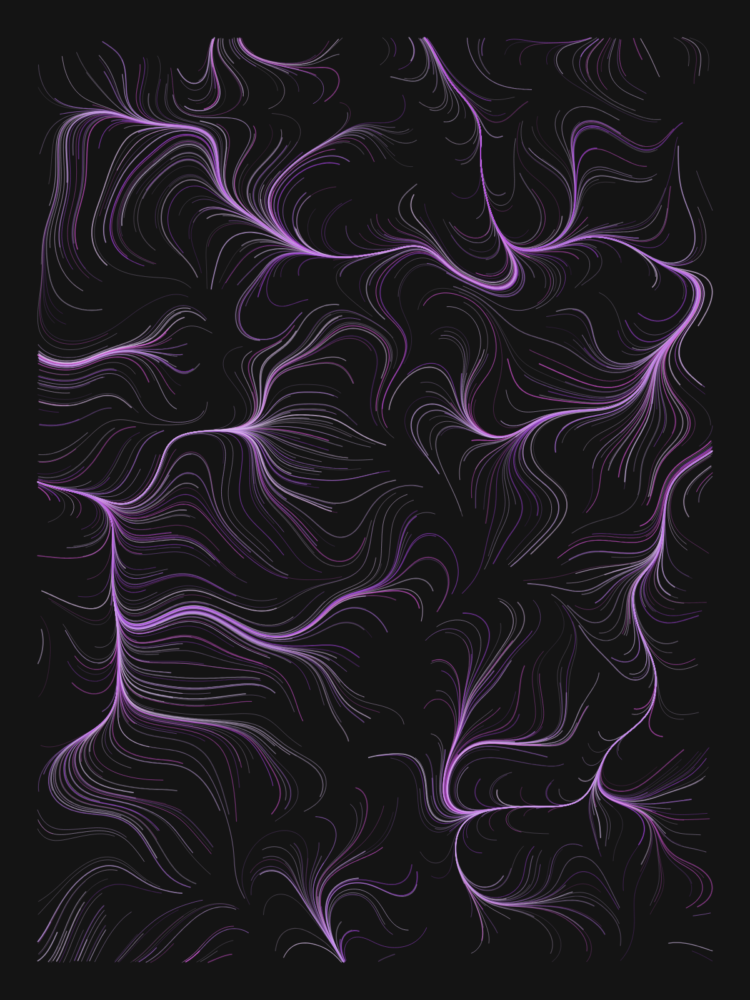
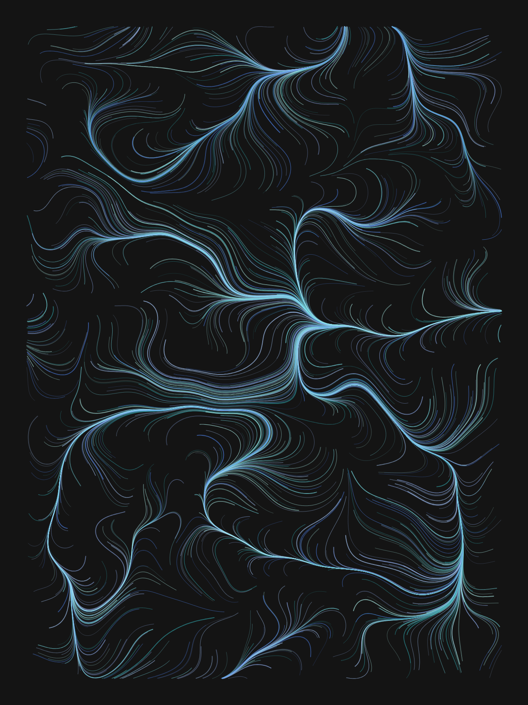
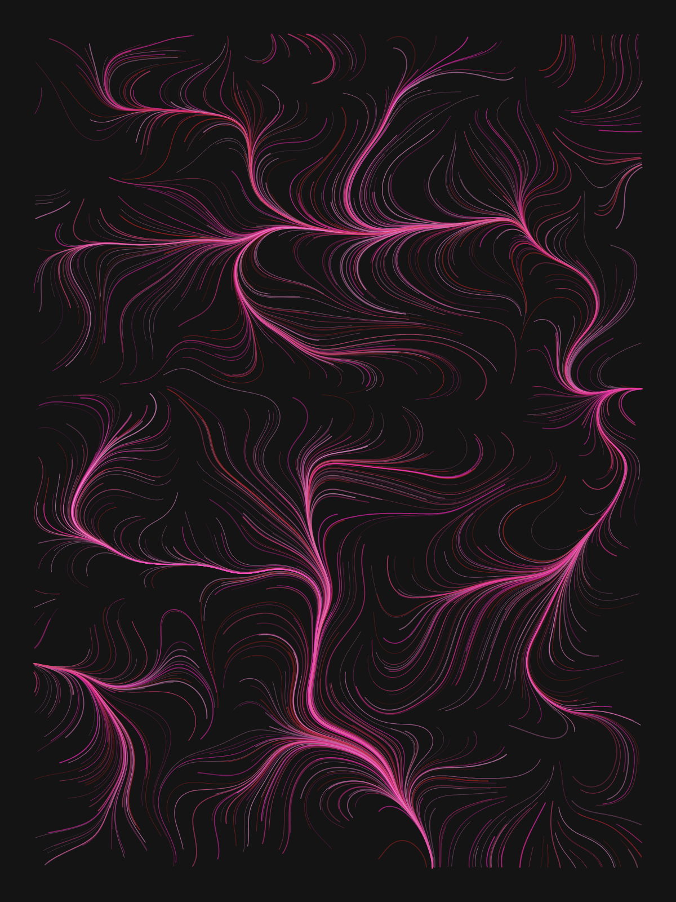
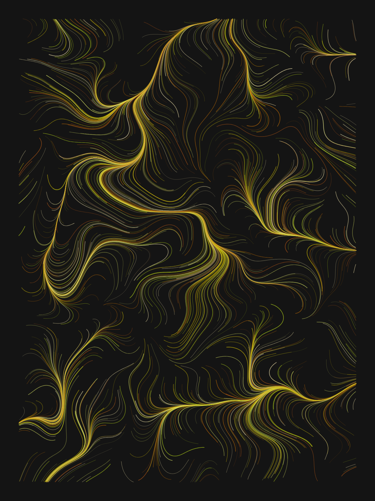

# AIFun

A few small generative-art toys written in **mostly pure Python** — standard
library only, apart from one optional GIF exporter. Throwaway weekend code that
turned out kind of pretty.

---

## 🐠 `aquarium.py` — terminal aquarium

An animated ASCII aquarium that runs right in your terminal. Fish made of
`><(((°>` swim left and right, wrap around the edges and flip direction,
randomly drift up and down, and change colour each lap. Bubbles spawn at the
bottom and wobble their way up to the surface. The top is a `~~~` waterline,
the bottom sands itself in with scattered `.`/`_` grains.

Everything scales to your terminal size — a wider window gets more fish.

```bash
python3 aquarium.py      # Ctrl-C to quit
```

**How it works**

- Each `Fish` carries its own direction, speed, colour and ASCII body, and
  re-randomises them whenever it swims off-screen.
- Each frame is composed into a character grid + a parallel colour grid, then
  flushed in one write using ANSI escape codes (`\033[H` to home the cursor,
  hidden cursor while running).
- ~8 frames/sec via `time.sleep(0.12)`. No curses, no external libs.

---

## 🌀 `flowfield.py` — flow-field generative art

Draws curving "ink" lines by releasing ~1400 particles into an invisible
**flow field** and letting them ride the currents. Every run is unique:
the noise field, the seed, and the colour palette are all randomised. Output
is a single self-contained **SVG** (vector, infinitely zoomable).

```bash
python3 flowfield.py      # writes flowfield.svg, prints the seed
```

**How it works**

- **Value noise from scratch** — a hashed integer lattice with quintic
  smoothing (Perlin's `6t⁵−15t⁴+10t³` fade, which kills the creasing you get
  from plain smoothstep). No `numpy`, no noise library.
- The noise value at each point becomes an **angle**; two octaves are summed
  to give a swirling field. Each particle repeatedly steps in the direction
  of the field, tracing a path until it leaves the canvas.
- A random **HSL palette** picks one hue family and varies lightness, so each
  piece is colour-coherent. Line width and opacity are jittered per stroke to
  build up depth.
- The print line reports the `seed` so a result you like can be reproduced.

**Tweakables** (top of the file): `N_PARTICLES`, `STEPS`, `STEP_LEN`, `GRID`
(field frequency), canvas `W`/`H`, and `MARGIN`.

---

## 🐦 `boids.py` — flocking simulation

Craig Reynolds' classic **boids**: each bird steers by just three local rules —
**separation** (don't crowd neighbours), **alignment** (match their heading),
**cohesion** (drift toward their centre) — and a swarm emerges with no leader
and no global plan. A minimum-speed rule keeps every bird cruising so the flock
never collapses into a stationary clump.

```bash
python3 boids.py          # -> boids.svg : one still, trails = the swarm's path
python3 boids.py --gif    # -> boids.gif : animation (needs Pillow)
```



**How it works**

- Each `Boid` scans neighbours within a perception radius and accumulates the
  three steering vectors, each capped by `MAX_FORCE` so turns stay smooth.
- Separation is weighted highest and a `MIN_SPEED` floor stops the flock from
  stalling — the two fixes that turn a dead clump into a living swarm.
- The **SVG** mode traces each bird's full path into vector ink. The **GIF**
  mode draws fading per-bird tails frame by frame with Pillow.
- Soft walls near the canvas edge nudge birds back inward instead of hard
  bouncing, so the flock wanders the whole frame.

**Tweakables** (top of the file): `N_BOIDS`, `PERCEPTION`, `SEPARATION`,
`MAX_SPEED`/`MIN_SPEED`, `MAX_FORCE`, `TRAIL`.

---

## 🎡 `harmonograph.py` — pendulum drawing machine

A digital **harmonograph** — the Victorian contraption where a pen tied to two
or three swinging, slowly-dying pendulums draws hypnotic looping figures. The
pen position is just a sum of **decaying sine waves**; because the pendulums
are detuned a hair off whole-number ratios, the figure precesses instead of
closing, and the damping makes it spiral gently inward as the swing dies.

```bash
python3 harmonograph.py            # -> harmonograph.svg : one still (no deps)
python3 harmonograph.py --gif      # -> harmonograph.gif : pen draws live (Pillow)
python3 harmonograph.py --seed 7   # reproduce a specific figure
```



**How it works**

- Each `Pendulum` is `amp * sin(2π·freq·t + phase) · e^(−damp·t)` — a sine that
  fades. The pen sums two pendulums per axis; X and Y ride **different** low
  ratios so the figure opens into a full 2-D loop instead of collapsing onto a
  line (the failure mode when both axes share a ratio and drift into phase).
- The hue drifts along the curve as it's drawn, so the ink shifts colour like
  it's slowly drying — same trick in both SVG and GIF renderers.
- Every run randomises frequencies, phases, damping and palette, and prints the
  `seed` so a figure you like can be reproduced.

**Tweakables** (top of the file): `DURATION`, `DT` (curve smoothness / file
size), `BASE_FREQ`, `DETUNE`, `LINE_W`.

---

## 🛰 `iss.py` — where is the ISS right now?

Not generative art — a live-data toy. Fetches the **International Space
Station's** current position from the open-notify.org API and plots it as a
bright `@` on an ASCII world map in your terminal. It also prints the crew
list the API returns — but that particular feed is **known to be stale**
(it has served the same old snapshot for a long time), so the script labels
it as such. The `@` position, however, is genuinely live.

```bash
python3 iss.py            # one snapshot
python3 iss.py --track    # live: re-fetches every 5s, Ctrl-C to quit
```

Needs internet, but **no API key and no third-party libraries** — just
`urllib` from the standard library.

**How it works**

- Two GETs: `iss-now.json` (lat/lon) and `astros.json` (crew list).
- The map is a hand-drawn **equirectangular** grid; lat/lon project straight
  to (row, col). The continent layout was checked against real coordinates —
  London, Tokyo, Sydney, Rio and NYC all land on the right landmass — so the
  `@` sits where the station actually is, ocean and all.
- `--track` loops with a home-and-clear so the station drifts across the map
  in real time (~27 600 km/h, so it visibly moves every few seconds).

---

## 🌍 `quakesong.py` — listen to the Earth

Another live-data toy, but this one makes **music**. It pulls the last 24
hours of earthquakes from the USGS real-time feed and sonifies them into a
~80-second stereo WAV, plus an SVG poster showing where every note came from.

The mapping: time of quake → position in the piece, **magnitude → loudness**
and how long the bell rings, **depth → pitch** (shallow quakes chime high,
600 km deep-focus quakes toll low), longitude → stereo pan. Pitches snap to
an A-minor pentatonic scale, so whatever the planet did today comes out
vaguely musical. Every day is a different piece.

```bash
python3 quakesong.py                 # fetch + write quakesong.wav / .svg
python3 quakesong.py --min-mag 4.5   # only the big ones
python3 quakesong.py --seconds 120   # stretch the day over 2 minutes
```

**How it works**

- One GET to the USGS `all_day.geojson` feed (no key needed).
- Each quake is a struck bell: three inharmonic partials (1×, 2.76×, 5.4×)
  with exponential decay — rendered with a rotating **complex phasor**
  (`z *= step`) instead of calling `math.sin` per sample, which keeps pure
  Python fast enough to mix hundreds of bells in seconds.
- Quakes ≥ M5.5 get a sub-octave toll underneath.
- Depth → pitch uses a log scale (most quakes are ~10 km, a few are 600 km),
  then snaps to a 4-octave pentatonic table.
- The WAV is written with the stdlib `wave` module; the poster
  (`quakesong.svg`) plots every quake on a graticule — ring size is
  magnitude, colour is depth (amber = shallow → violet = deep) — with a
  timeline of the piece underneath.

There's also **`quakesong.html`** — a self-contained interactive player.
Open it straight from disk in any browser (no server needed): it fetches
the **live USGS feed** on load (the feed is CORS-open, so this works even
from `file://`), falls back to an embedded snapshot when offline, and
plays today's quakes with the same bell synth rebuilt in WebAudio.
Ripples burst on a world map in sync with the sound, the score strip is
click-to-seek, and the **↓ WAV button** renders the whole piece offline
(`OfflineAudioContext`) and downloads it — so the generated WAV isn't
checked into the repo, you always make a fresh one.

---

## 🖼 gallery

Five sample renders from `flowfield.py`, each as both PNG (preview) and SVG
(source). They show the range of palettes the script produces — same code,
different seed.

| | | |
|---|---|---|
|  |  |  |
|  |  | |

---

## requirements

Python 3.6+ and nothing else — except the `--gif` modes of `boids.py` and
`harmonograph.py`, which need [Pillow](https://pypi.org/project/Pillow/)
(`pip install pillow`). Everything else, including every SVG mode, is pure
standard library.
